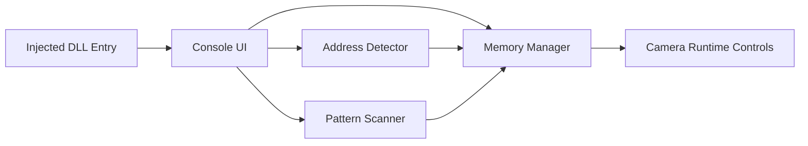

# dsremaster-debuger

Debug camera and memory tooling for Dark Souls Remastered runtime analysis.

## Why this repo matters
This repository demonstrates practical reverse-engineering and runtime tooling patterns:
- deterministic memory scanning pipelines for camera/player address discovery
- interactive debug menu for position control and operational tuning
- guard-railed memory read/write operations with page accessibility checks
- modular components that can be reused in other game-runtime tooling

## Architecture


Detailed design: `docs/ARCHITECTURE.md`.

## Key commands
- `showpos`, `setpos`, `addpos`
- `scan`, `autoscan`, `list`
- `status`, `speed`, `fov`, `timescale`
- `savepos`, `gotopos`, `bookmarks`

## Build
### Visual Studio / MSBuild
```powershell
msbuild DarkSoulsDebugMenu.sln /p:Configuration=Debug /p:Platform=x64
msbuild DarkSoulsDebugMenu.sln /p:Configuration=Release /p:Platform=x64
```

## Validation checklist
- Inject Debug build into the game process.
- Run `autoscan`, verify camera addresses are discovered.
- Run `showpos`, `savepos`, `addpos`, `gotopos` to confirm bookmark flow.
- Run `status`, adjust `speed`/`fov`/`timescale` values.

## Security
- Policy: `SECURITY.md`
- Threat model: `docs/THREAT_MODEL.md`

## Roadmap
See `docs/ROADMAP.md`.
