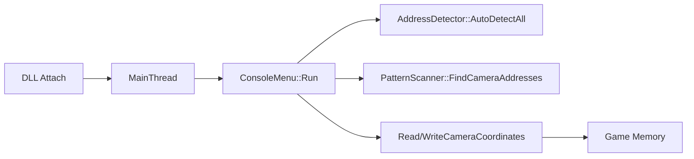

# Architecture

## Components
- `dllmain.cpp`: DLL attach/detach lifecycle.
- `DebugCamera.cpp`: runtime control thread and command loop host.
- `ConsoleUI.cpp`: command routing and operator interaction.
- `AddressDetector.cpp`: multiphase behavior-based address classification.
- `PatternScanner.cpp`: signature-guided scan fallback.
- `MemoryManager.cpp` + `MemoryUtils.cpp`: safe read/write wrappers.

## Runtime flow

## Safety controls
- Memory page accessibility checks before read/write.
- Input validation for movement speed, FOV, and timescale.
- Bookmark operations route through verified camera address selection.
